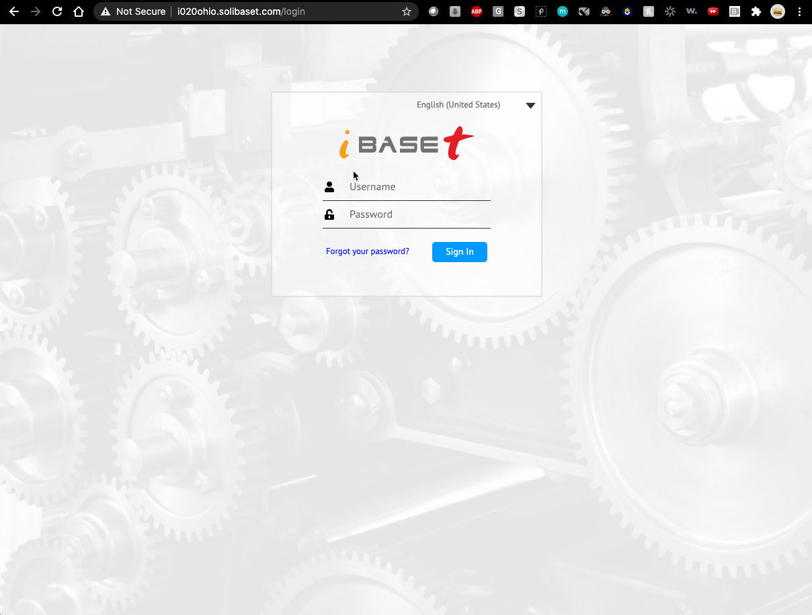

// Add steps as necessary for accessing the software, post-configuration, and testing. Don’t include full usage instructions for your software, but add links to your product documentation for that information.
//Should any sections not be applicable, remove them

== Test the deployment
// If steps are required to test the deployment, add them here. If not, remove the heading

. Navigate to the URL for Solumina using the endpoint that you noted in the previous section.
. Log in to the Solumina server using the setup credentials (the default setup creates an administrator profile). Contact https://www.ibaset.com/contact/[iBASEt^] sales for licensing information. You will be able to complete the login after installing the license.

[#test-page1]
._{partner-product-short-name}_ login page
[link=images/test-page.png]

== Post deployment steps
// If Post-deployment steps are required, add them here. If not, remove the heading

== Best practices for using {partner-product-short-name} on AWS
// Provide post-deployment best practices for using the technology on AWS, including considerations such as migrating data, backups, ensuring high performance, high availability, etc. Link to software documentation for detailed information.

_Add any best practices for using the software._

== Security
// Provide post-deployment best practices for using the technology on AWS, including considerations such as migrating data, backups, ensuring high performance, high availability, etc. Link to software documentation for detailed information.

_Add any security-related information._

== Other useful information
//Provide any other information of interest to users, especially focusing on areas where AWS or cloud usage differs from on-premises usage.

_Add any other details that will help the customer use the software on AWS._