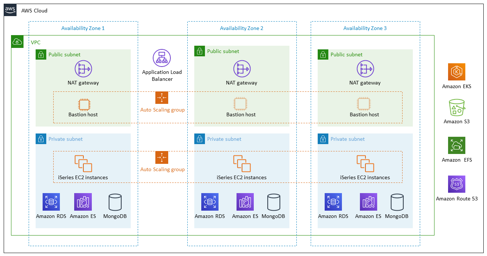

Deploying this Quick Start for a new virtual private cloud (VPC) with
default parameters builds the following _{partner-product-short-name}_ environment in the
AWS Cloud.

// Replace this example diagram with your own. Send us your source PowerPoint file. Be sure to follow our guidelines here : http://(we should include these points on our contributors giude)
[#architecture1]
.Quick Start architecture for _{partner-product-short-name}_ on AWS
[link=images/architecture_diagram.png]

As shown in Figure 1, the Quick Start sets up the following:

* A highly available architecture that spans three Availability Zones.*
* A VPC configured with public and private subnets, according to AWS
best practices, to provide you with your own virtual network on AWS.*
* An Application Load Balancer to route traffic to the Solumina iSeries application over HTTP.
* In the public subnets:
** Managed network address translation (NAT) gateways to allow outbound
internet access for resources in the private subnets.*
** Linux bastion hosts in an Auto Scaling group to allow inbound Secure
Shell (SSH) access to EC2 instances in public and private subnets.*
* In the private subnets:
** Solumina iSeries EC2 instances located in an Auto Scaling group.
** Amazon Relational Database Service (Amazon RDS).
** Amazon Elasticsearch Service (Amazon ES).
** A MongoDB resource.
* Amazon Elastic Kubernetes Service (Amazon EKS).
* An Amazon S3 bucket for storing Quick Start assets.
* Amazon Elastic File System (Amazon EFS) to provide on-demand scaling and management of AWS Cloud services and resources.
* A Recordset object in Amazon Route 53 for the iSeries application.

*The template that deploys the Quick Start into an existing VPC skips
the components marked by asterisks and prompts you for your existing VPC
configuration.
